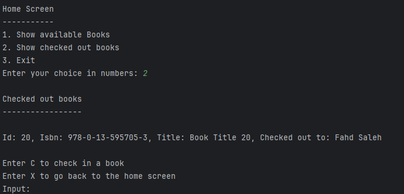
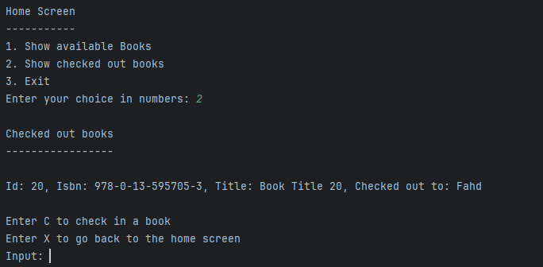

# neighborhood-library
## Over view of the project
I am making a project for my neighbor hood library and the library should allow the customer to check out a book and also check in. The checked out book will keep track of the person's name. When ever the person checks in the book he will not be tracked in the system anymore. 

I created a book class to allow me to make an array of objects from books


## Screens

Screens Sketch

### Home screen 
The home screen is going to prompt the user to show available books, Show checked out books, and Exit if the user clicks exit it will stop the program. if a user enters 1 it will take them to the Show available books screen. If a user enter's 2 it will display the checked out screen.


Code for Home Screen
```java
public static void homeScreen(Book[] books){

        String input = "";
        int choice = 0;

            while(choice != 3) {
                // displaying home screen
                System.out.println();
                System.out.println("Home Screen");
                System.out.println("-----------");
                System.out.println("1. Show available Books");
                System.out.println("2. Show checked out books");
                System.out.println("3. Exit ");
                System.out.print("Enter your choice in numbers: ");
                input = userInput.nextLine();

                choice = checkChoice(input);

                switch (choice) {
                    case 1:
                        // shows available books
                        showAvailableBooks(books);
                        break;
                    case 2:
                        //shows checked out books
                        showCheckedOutBooks(books);
                        break;
                    case 3:
                        // Exits the program
                        System.out.println("Good bye :)");
                        break;
                    default:
                        if (choice > 3){
                            System.out.println("Invalid input");
                        }
                }
            }
    }
```
### Availablty screen

In the availablty screen it will display all the available books and the user will be prompt to check out a book if they enter 1 or exit back to the home screen if they click 2.


code for show availablty screen

```java
public static void showAvailableBooks(Book[] books){

        //displaying Available books
        boolean foundAvailableBooks = false;
        System.out.println();
        System.out.println("Available Books");
        System.out.println("---------------");
        for(int i = 0; i < books.length; i++){
            if(!books[i].isCheckedOut()){
                System.out.printf("Id: %d, Isbn: %s, Title: %s, Checked out: %b%n ", books[i].getId(), books[i].getIsbn(), books[i].getTitle(), books[i].isCheckedOut());
                foundAvailableBooks = true;
            }
        }

        if(!foundAvailableBooks){
            System.out.println("There is no available books");
        }

        // prompting the user to check out a book or exit
        System.out.println();
        System.out.println("1. Check out a book");
        System.out.println("2. Exit to go back to home screen");
        System.out.print("Enter your choice in integers: ");
        String input = userInput.nextLine();
        int choice = checkChoice(input);

        // checking user's choice and getting the name
        String name = "";
        switch (choice){
            case 1:
                System.out.println();
                System.out.print("Please enter your name to check out the book: ");
                name = userInput.nextLine();
                checkOutBooks(books, name);
                break;
            case 2:
                homeScreen(books);
            default:
                if(choice > 2){
                    System.out.println();
                    System.out.println("Invalid selection");
                }
        }
    }
```

### Show checked out books screen

This screen shows all the books that are checked out and prompt's the user to check in a book or go back to home screen. If the user check's in a book it will ask for the book id to check it in.



code user for showing, checked out books

```java
public static void showCheckedOutBooks(Book[] books){

        boolean foundCheckedOutBooks = false;
        System.out.println();
        System.out.println("Checked out books");
        System.out.println("-----------------");

        for (int i = 0; i < books.length; i++){
            if(books[i].isCheckedOut()){
                System.out.println();
                System.out.printf("Id: %d, Isbn: %s, Title: %s, Checked out to: %s \n", books[i].getId(), books[i].getIsbn(), books[i].getTitle(), books[i].getCheckedOutTo());
                foundCheckedOutBooks = true;
            }
        }

        // checking if there is any checked out books if not then it will print "There is no checked out books"
        if(!foundCheckedOutBooks){
            System.out.println("There is no checked out books");
        }
        
        String choice = "";

        while (!choice.equals("x")){

            //getting user input to check in a book or go back to home screen
            System.out.println();
            System.out.println("Enter C to check in a book");
            System.out.println("Enter X to go back to the home screen");
            System.out.print("Input: ");
            choice = userInput.nextLine().toLowerCase();

            switch (choice){
                case "c":
                    checkInBook(books);
                    break;
                case "x":
                    homeScreen(books);
                    break;
                default:
                    System.out.println("Invalid input");
                    break;
            }
        }
    }
```

## Input Validation

For my input validation I used a helper method that takes in the input as string. The method has String "numbers" that contain's numbers from 0-9. When the input get's passed into the method it checks if the numbers contains the input. If it does it converts it to an integer then returns it. 


``` java

public static int checkChoice(String input){

        //1. first getting the input as a string
        String numbers = "0123456789";
        int choice = 0;

        //2. checking if string numbers contains the input
        if(numbers.contains(input)){
            // if it does then convert input to an int and store it into choice
            choice = Integer.parseInt(input);
        } else {
            // if it doesn't then print "Invalid input please enter a number"
            System.out.println();
            System.out.println("Invalid input please enter a number");
        }

        //3. returning choice
        return choice;
    }
```

## Instruction on how to use the application
### Home screen

when your in the home screen the application will prompt you to show available books, show checked out books, and exit to close the application.


* 1. Enter 1 to show available all the available books
* 2. Enter 2 to show the checked out books
* 3. Enter 3 to exit the application


### Availablty screen


1. Enter 1 to check out a book, the program will prompt you for
your name and the book id you want to check out. It will then
display your name and the book you checked out.


2. Enter 2 to go back to home screen.

### Show checked out books screen
if there is checked out books and you enter 2 to show checked out books it will display the all the checked out books, and who are they checked out to.


You could enter C to check in the book with the id or X to go back to home screen


it will then prompt you again if you want to check in another book go back to home screen
